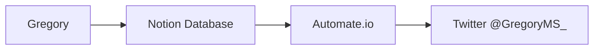

# Changelog

## 1.8.1

### New Sources Added for Clinical Trials and Articles

- None

### New Features

1. Adds new API endpoints to search the database by keyword
2. Adds a new section called Observatorio that lists promissing research according to the MS Society Website. https://www.mssociety.org.uk/research/explore-our-research/emerging-research-and-treatments/explore-treatments-in-trials

### Changes

- Adds the new section to the menu

## 1.6

### New Sources Added for Clinical Trials

- [CUF](https://www.cuf.pt/cuf-academic-center/ensaios-clinicos?combine=&unidade=&estado=All&patologia=2346&especialidade=)
- [Novartis](https://www.novartis.com/clinicaltrials/recruiting-trials?title=multiple%20sclerosis)

### New Features

1. A digest of new articles is sent to the Admin every 48h so that the most relevant findings can be flagged.
2. Weekly digest is sent to the subscribers, it lists the articles flagged by the admin.
3. The Admin now receives a notification of new clinical trials as they are posted.

### Changes

1. The file  notification flows.json replaces newsletter.json
2. The main json file with the node-red flows was cleaned up and corrected some missing links between nodes
3. The database schema was added to the repository as `gregory_schema.sql`
4. The full sqlite database was added to the repository as `gregory.sql`
5. A new flow was added that integrates with twitter using a [Notion](https://www.notion.so/) database 

### Twitter integration

Results that are flagged as relevant are posted in the account @[GregroryMS_](https://twitter.com/gregoryms_) using the service provided by [Automate.io](https://automate.io/).

## 1.2

- Fixes #5 and #8
- Cleans up the build script a bit
- Organizes theme files to help development