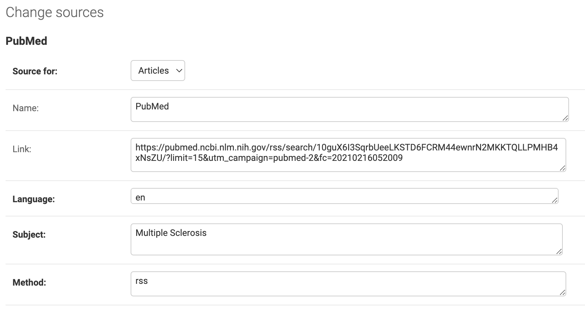
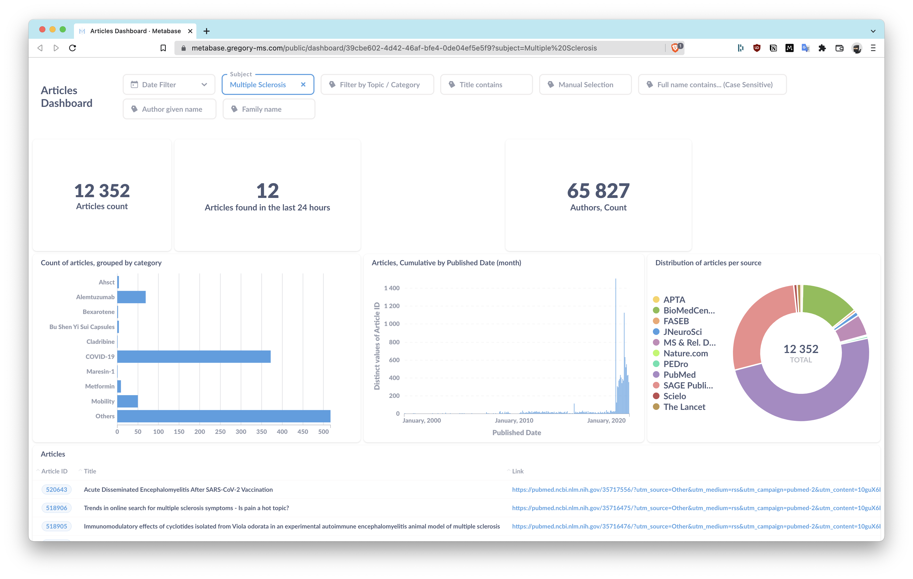

# Gregory MS

Gregory is an AI system that uses Machine Learning and Natural Language Processing to track
clinical research and identify papers which improves the wellbeing of patients.

Sources for research can be added by RSS feed or manually.

The output can be seen in a static site, using `build.py` or via the api provided by the Django Rest Framework.

The docker compose file also includes a Metabase container which is used to build dashboards and manage notifications.

Sources can also be added to monitor Clinical Trials, in which case Gregory can notify a list of email subscribers.

For other integrations, the Django app provides RSS feeds with a live update of relevant research and newly posted clinical trials.

#### Website: <https://gregory-ms.com>

#### Rest API: <https://api.gregory-ms.com>

### Current sources for searches

1. APTA
2. BioMedCentral
3. FASEB
4. JNeuroSci
5. MS & Rel. Disorders
6. PEDro
7. pubmed
8. Sage Pub
9. Scielo
10. The Lancet

## Running in Production

### Server Requirements

- [ ] [Docker](https://www.docker.com/) and [docker-compose](https://docs.docker.com/compose/) with 2GB of swap memory to be able to build the MachineLearning Models. ([Adding swap for Ubuntu](https://www.digitalocean.com/community/tutorials/how-to-add-swap-space-on-ubuntu-20-04))
- [ ] [Mailgun](https://www.mailgun.com/) (optional)

### Installing Gregory

1. **Install python dependencies locally**
2. **Edit the .env file** to reflect your settings and credentials.

```bash
DOMAIN_NAME=DOMAIN.COM
# Set this to the subdomain you configured with Mailgun. Example: mg.domain.com
EMAIL_DOMAIN=
# The SMTP server and credentials you are using. For example: smtp.eu.mailgun.org
# These variables are only needed if you plan to send notification emails
EMAIL_HOST=
EMAIL_HOST_PASSWORD=
EMAIL_HOST_PASSWORD=
EMAIL_HOST_USER=
# We use Mailgun by default on the newsletters, input your API key here
EMAIL_MAILGUN_API_URL=
EMAIL_PORT=587
EMAIL_USE_TLS='True'
# Where you cloned the repository
GREGORY_DIR=
# Leave this blank and come back to them when you're finished installing Metabase.
METABASE_SECRET_KEY=
# Where do you want to host Metabase?
METABASE_SITE_URL='https://metabase.DOMAIN.COM/'
# Set your postgres DB and credentials
POSTGRES_DB=
POSTGRES_PASSWORD=
POSTGRES_USER=
SECRET_KEY='Yeah well, you know, that is just, like, your DJANGO SECRET_KEY, man' # you should set this manually https://docs.djangoproject.com/en/4.0/ref/settings/#secret-key
```

3. **Execute** `python3 setup.py`.

The script checks if you have all the requirements and run to help you setup the containers.

Once finished, login at <https://api.DOMAIN.TLD/admin> or wherever your reverse proxy is listening on.

4. **Configure** your RSS Sources in the Django admin page.

5. **Setup** database maintenance tasks.

Gregory needs to run a series of tasks to fetch missing information before applying the machine learning algorithm. For that, we are using [Django-Con](https://github.com/Tivix/django-cron). Add the following to your crontab:

```cron
*/5 * * * * /usr/bin/docker exec admin ./manage.py runcrons > /root/log
```

## How everything fits together

### Django and Postgres

Most of the logic is inside Django, the **admin** container provides the [Django Rest Framework](https://www.django-rest-framework.org/), manages subscriptions, and sends emails.

The following subscriptions are available:

**Admin digest**

This is sent every 48 hours with the latest articles and their machine learning prediction. Allows the admin access to an Edit link where the article can be edited and tagged as relevant.

**Weekly digest**

This is sent every Tuesday, it lists the relevant articles discovered in the last week.

**Clinical Trials**

This is sent every 12 hours if a new clinical trial was posted.

The title of the email footer for these emails needs to be set in the Custom Settings section of the admin backoffice.

Django also allows you to add new sources from where to fetch articles. Take a look at `/admin/gregory/sources/ `



### Node-RED

We use [Node-RED](https://nodered.org/) to collect articles from sources without an RSS. These flows need to be added manually and configured to write to the postres database. If your node-red container does not show a series of flows, import the `flows.json` file from this repository.

### Metabase

A database is only as good as it's ability to answer questions. We have a separate `metabase` container in the docker-compose.yaml file that connects directly to Gregory's database.

It's available at <http://localhost:3000/>

The current website also uses some embeded dashboards whose keys are produced each time you run `build.py`. An example can be found in the [MS Observatory Page](https://gregory-ms.com/observatory/)



Including dashboards in your content:

1. Add the dashboard ID to `data/dashboards.json`
2. In your content, use the shortcode `{{ metabase-embed dashboard="10" width="1300" height="1250" }}`
3. Run `build.py`

### Mailgun

Emails are sent from the `admin` container using Mailgun.

To enable them, you will need a mailgun account, or you can replace them with another way to send emails.

You need to configure the relevant variables for this to work:

```bash
EMAIL_USE_TLS=true
EMAIL_MAILGUN_API='YOUR API KEY'
EMAIL_DOMAIN='YOURDOMAIN'
EMAIL_MAILGUN_API_URL="https://api.eu.mailgun.net/v3/YOURDOMAIN/messages"
```

As an alternative, you can configure Django to use any other email server.

### RSS feeds and API

Gregory has the concept of 'subject'. In this case, Multiple Sclerosis is the only subject configured. A Subject is a group of Sources and their respective articles. There are also categories that can be created. A category is a group of articles whose title matches at least one keyword in list for that category. Categories can include articles across subjects.

There are options to filter lists of articles by their category or subject in the format `articles/category/<category>` and `articles/subject/<subject>` where <category> and <subject> is the lowercase name with spaces replaced by dashes.

#### Available RSS feeds

1. Latest articles, `/feed/latest/articles/`
2. Latest articles by subject, `/feed/articles/subject/<subject>/`
3. Latest articles by category, `/feed/articles/category/<category>/`
4. Latest clinical trials, `/feed/latest/trials/`
5. Latest relevant articles by Machine Learning, `/feed/machine-learning/`
6. Twitter feed, `/feed/twitter/`. This includes all relevant articles by manual selection and machine learning prediction. It's read by [Zapier](https://zapier.com/) so that we can post on twitter automatically.

## How to update the Machine Learning Algorithms

This is not working right now and there is a [pull request to setup an automatic process to keep the machine learning models up to date](https://github.com/brunoamaral/gregory/pull/110).

It's useful to re-train the machine learning models once you have a good number of articles flagged as relevant.

1. `cd docker-python; source .venv/bin/activate`
2. `python3 1_data_processor.py`
3. `python3 2_train_models.py`

## Running for local development

Edit the env.example file to fit your configuration and rename to .env

```bash
sudo docker-compose up -d
python3 -m venv env
source env/bin/activate
pip install -r requirements.txt
```

## Thank you to

- @[Antoniolopes](https://github.com/antoniolopes) for helping with the Machine Learning script.
- @[Chbm](https://github.com/chbm) for help in keeping the code secure.
- @[Jneves](https://github.com/jneves) for help with the build script
- @[Malduarte](https://github.com/malduarte) for help with the migration from sqlite to postgres.
- @[Melo](https://github.com/melo) for showing me [Hugo](https://github.com/gohugoio/hugo)
- @[Nurv](https://github.com/nurv) for the suggestion in using Spacy.io
- @[Rcarmo](https://github.com/rcarmo) for showing me [Node-RED](https://github.com/node-red/node-red)

And the **Lobsters** at [One Over Zero](https://github.com/oneoverzero)
