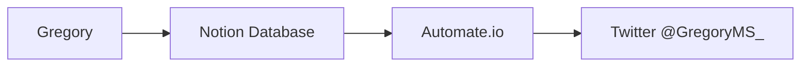

# Gregory
Gregory aggregates searches in JSON and outputs to a Hugo static site

# Live Version

https://labs.brunoamaral.eu

# Changelog

## 1.8.1

### New Sources Added for Clinical Trials and Articles

- None

### New Features

1. Adds new API endpoints to search the database by keyword
2. Adds a new section called Observatorio that lists promissing research according to the MS Society Website. https://www.mssociety.org.uk/research/explore-our-research/emerging-research-and-treatments/explore-treatments-in-trials

### Changes

- Adds the new section to the menu


## 1.6

### New Sources Added for Clinical Trials

- [CUF](https://www.cuf.pt/cuf-academic-center/ensaios-clinicos?combine=&unidade=&estado=All&patologia=2346&especialidade=)
- [Novartis](https://www.novartis.com/clinicaltrials/recruiting-trials?title=multiple%20sclerosis)

### New Features

1. A digest of new articles is sent to the Admin every 48h so that the most relevant findings can be flagged.
2. Weekly digest is sent to the subscribers, it lists the articles flagged by the admin.
3. The Admin now receives a notification of new clinical trials as they are posted.

### Changes

1. The file  notification flows.json replaces newsletter.json
2. The main json file with the node-red flows was cleaned up and corrected some missing links between nodes
3. The database schema was added to the repository as `gregory_schema.sql`
4. The full sqlite database was added to the repository as `gregory.sql`
5. A new flow was added that integrates with twitter using a [Notion](https://www.notion.so/) database 

### Twitter integration

Results that are flagged as relevant are posted in the account @[GregroryMS_](https://twitter.com/gregoryms_) using the service provided by [Automate.io](https://automate.io/).




## 1.2

- Fixes #5 and #8
- Cleans up the build script a bit
- Organizes theme files to help development

# Install

```bash 
git clone git@github.com:brunoamaral/gregory.git;
cd gregory;
hugo mod get -u;
hugo;
```
# Node-RED Flow

`data/articles.json` and `data/trials.json` are generated from a Node-Red flow available in the `flows.json` file.

# Build script

For an example on how to build the website, see build-example.py. The server URL was hidden for the time being. 

The path /api/articles.json and /api/trials.json includes the full database export.

The same information is available in excel format: /api/articles.xlsx and /api/trials.xlsx.

# Roadmap

New sources we would like to add:
 - RNEC
 - FirstWord Pharma
 - [EMA](https://www.ema.europa.eu/en/human-regulatory/research-development/clinical-trials/clinical-trials-information-system-training-support) (CTIS system to be made available online on January 2022)
 - Champalimaud Foundation
 - CEIC (Doesn't seem to have any public database)


# Thank you to

@[Chbm](https://github.com/chbm) for help in keeping the code secure.
@[Jneves](https://github.com/jneves) for help with the build script    
@[Melo](https://github.com/melo) for showing me [Hugo](https://github.com/gohugoio/hugo)    
@[Nurv](https://github.com/nurv) for the suggestion in using Spacy.io    
@[RainerChiang](https://github.com/RainerChiang) for the [Simplesness theme](https://github.com/RainerChiang/simpleness)    
@[Rcarmo](https://github.com/rcarmo) for showing me [Node-RED](https://github.com/node-red/node-red)       

And the Lobsters at [One Over Zero](https://github.com/oneoverzero)

