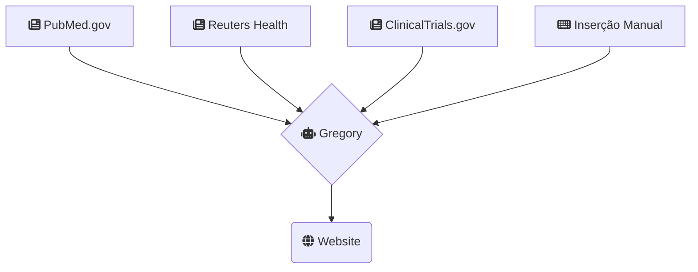

> O excesso de informação é tão mau como a falta de informação.

Este site é destinado a ser usado por profissionais de saúde e permite facilitar a pesquisa em tempo real de artigos e notícias relacionadas com a Esclerose Múltipla.

A recolha dos dados é feita de forma automática, por um robot de nome **Gregory**, várias vezes por hora.

Na primeira página são apresentados alguns resultados que merecem destaque por se incluir numa destas categorias:

1. Medicação que ajude a regeneração do sistema nervoso;
2. Medicação ou tratamento dos sintomas;
3. Novos tratamentos;

## Fontes de Informação

O **Gregory** é capaz de usar vários sites para executar pesquisas. Neste momento estamos a usar as seguintes fontes de informação. É possível acrescentar mais fontes onde pesquisar, e afinar os termos de pesquisa. Para isso, basta usar os contactos que estão no final desta página.

### Termos de pesquisa:

> Multiple Sclerosis, autoimmune encephalomyelitis, encephalomyelitis, immune tolerance, myelin

## Contactos para melhorias e sugestões

### Bruno Amaral    
mail@brunoamaral.eu

https://twitter.com/brunoamral     

[+351 912 875 856](tel:+351912875856)
