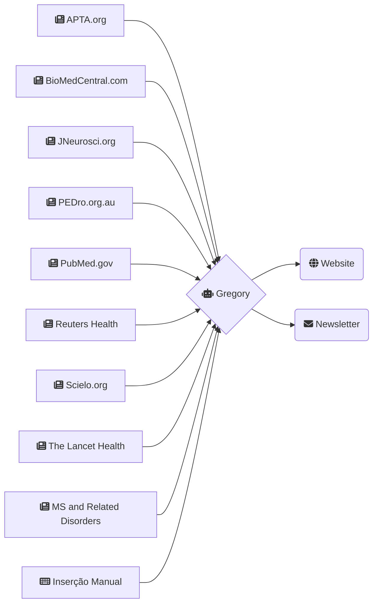
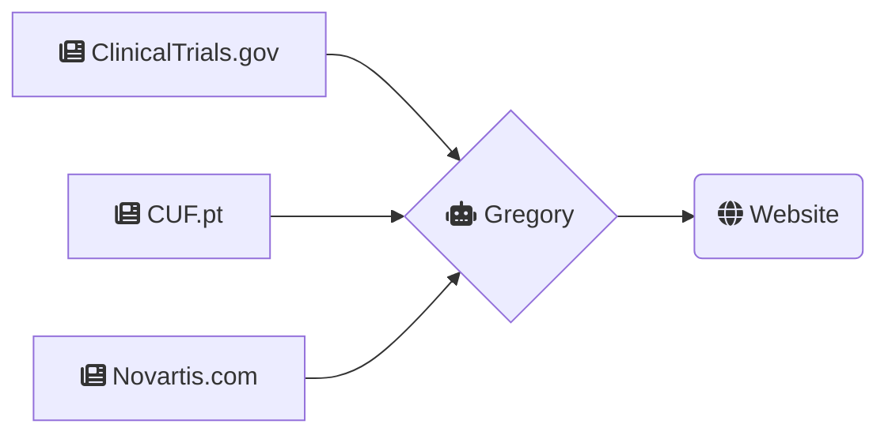

> O excesso de informação é tão mau como a falta de informação.

Este site é destinado a ser usado por profissionais de saúde e permite facilitar a pesquisa em tempo real de artigos e notícias relacionadas com a **Esclerose Múltipla**.

A recolha dos dados é feita de forma automática e contínua por um programa de nome **Gregory**.

Na primeira página são apresentados alguns resultados que merecem destaque por se incluirem numa destas categorias:

1. Medicação que promova a regeneração do sistema nervoso;
2. Medicação para tratamento dos sintomas;
3. Outros tratamentos;

## Fontes de Informação

O **Gregory** é capaz de usar várias fontes para executar pesquisas, e atualmente usa as seguintes fontes de informação. 

### Artigos Clínicos

### Ensaios Clínicos

É possível acrescentar mais fontes de informação e afinar os termos de pesquisa. Para isso, basta usar os contactos que estão no final desta página.

### Termos de pesquisa:

> Multiple Sclerosis, autoimmune encephalomyelitis, encephalomyelitis, immune tolerance, myelin

#### APTA

https://www.apta.org/search?Q=%22Multiple+Sclerosis%22+OR+%22autoimmune+encephalomyelitis%22+OR+encephalomyelitis+OR+%22immune+tolerance%22+OR+myelin&searcharticletypes=8834&searchconditionandsymptoms=&searchloc=APTA

#### BioMedCentral

https://www.biomedcentral.com/search?searchType=publisherSearch&sort=PubDate&page=1&query=Multiple+Sclerosis

#### ClinicalTrials

https://clinicaltrials.gov/ct2/results/rss.xml?rcv_d=14&lup_d=&sel_rss=new14&cond=Multiple+Sclerosis&count=10000

#### JNeurosci

https://www.jneurosci.org/search/text_abstract_title%3AMultiple%2BSclerosis%20text_abstract_title_flags%3Amatch-phrase%20exclude_meeting_abstracts%3A1%20numresults%3A50%20sort%3Apublication-date%20direction%3Adescending%20format_result%3Astandard

#### PEDro

https://search.pedro.org.au/advanced-search/results?abstract_with_title=Multiple+Sclerosis&therapy=0&problem=0&body_part=0&subdiscipline=0&topic=0&method=0&authors_association=&title=&source=&year_of_publication=&date_record_was_created=&nscore=&perpage=20&lop=or&find=&find=Start+Search

#### PubMed

https://pubmed.ncbi.nlm.nih.gov/rss/search/10guX6I3SqrbUeeLKSTD6FCRM44ewnrN2MKKTQLLPMHB4xNsZU/?limit=15&utm_campaign=pubmed-2&fc=20210216052009

#### Reuters

https://www.reutersagency.com/feed/?best-topics=health
#### Scielo

https://search.scielo.org/?q=Multiple+Sclerosis&lang=en&count=15&from=0&output=site&sort=&format=summary&fb=&page=1&q=%22Multiple+Sclerosis%22+OR+%22autoimmune+encephalomyelitis%22+OR+encephalomyelitis+OR+%22immune+tolerance%22+OR+myelin&lang=en&page=1

#### TheLancet

https://www.thelancet.com/action/doSearch?text1=%22Multiple+Sclerosis%22+OR+%22autoimmune+encephalomyelitis%22+OR+encephalomyelitis+OR+%22immune+tolerance%22+OR+myelin&field1=AbstractTitleKeywordFilterField&startPage=0&sortBy=Earliest

#### MS and Related Disorders

https://www.msard-journal.com/action/doSearch?text1=Multiple+Sclerosis&field1=AbstractTitleKeywordFilterField&startPage=0&sortBy=Earliest

#### Sage

https://journals.sagepub.com/action/doSearch?AllField=multiple+sclerosis&SeriesKey=msja&content=articlesChapters&countTerms=true&target=default&sortBy=Ppub&startPage=&ContentItemType=research-article

## Fontes por incluir

https://journals.bmj.com/

## Contactos para melhorias e sugestões

### Bruno Amaral    
mail@brunoamaral.eu

https://twitter.com/brunoamaral     

[+351 912 875 856](tel:+351912875856)
