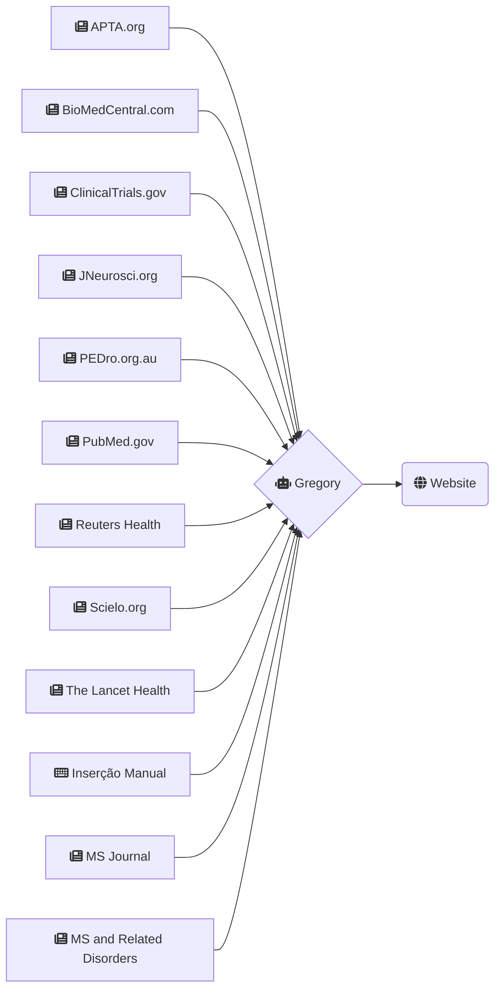

Por recomendação do Dr. João Sequeira, o site agora apresenta resultados recolhidos de mais dois sites:

1. [MS Journal](https://journals.sagepub.com/action/doSearch?AllField=multiple+sclerosis&SeriesKey=msja&content=articlesChapters&countTerms=true&target=default&sortBy=Ppub&startPage=&ContentItemType=research-article)
2. [MS and Related Disorders](https://www.msard-journal.com/action/doSearch?text1=Multiple+Sclerosis&field1=AbstractTitleKeywordFilterField&startPage=0&sortBy=Earliest)

Somam-se assim um total de 12 fontes de pesquisa.

Para mais informações ou para sugerir mais fontes de informação sobre Esclerose Múltipla, os contactos a usar são os seguintes:

<mail@brunoamaral.eu>

https://twitter.com/brunoamaral

+351 912 875 856

### Gráfico atualizado

