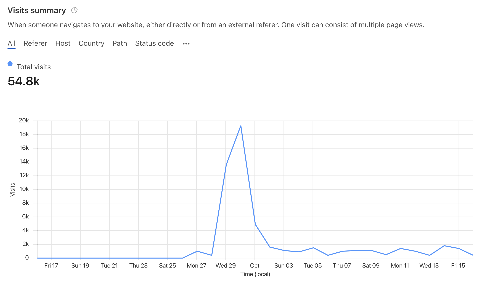

---
authors:
  - bruno-amaral
date: 2021-10-16T13:21:28+01:00
description: ""
draft: false
resources: 
- src: images/alejandro-escamilla-LF8gK8-HGSg-unsplash.jpeg
  name: "header"
- src: "gallery/*.jpg"
  name: gallery-:counter
  title: gallery-title-:counter
- src:
  name: slide-1
slug:
subtitle: 
tags: 
  - Bruno Amaral
  - brunp-amaral
categories: 
  - 
title: "A much needed update"

options:
  unlisted: false
  showHeader: true
  hideFooter: false
  hideSubscribeForm: false
  header: mini
scripts:
  -
---

Let me start by saying I feel exhausted and drained, so this update will feel a bit more personal.

Between life, work and Gregory, the last 40 or so days have been demanding and filled with good news. Let's focus on Gregory because he's the important one.

### Cloudflare{.title}

I am very grateful to Cloudflare, it became the first Company to officially support this project by providing their services under Project Galileo. This means a lot to us. It helps us provide you with a fast and secure website and to track how many visitors we have.

Cloudflare's web analytics feature is focused on privacy and will not track you in any intrusive way.

We plan to use this information to improve the website, by exploring new features and focusing on keeping the most visited pages up to date.

#### It is also a source of motivation {.title}

Up to this point I always felt like I was standing in a backroom of the web, building Gregory on my own, with friends that came to visit now and then to help me overcome obstacles and get the word out.

Turns out there was also a silent crowd with interest in what we are doing.

The spike you see in the chart happened when we launched the new design and shared it on some social networks.

### Automating the site with Machine Learning{.title}

Gregory became smarter thanks to [António Lopes](https://github.com/antoniolopes), he is the Head of Development at ISCTE, University Institute of Lisbon, and a researcher in Artificial Intelligence and Machine Learning. 

Thanks to António, **we were able to train Gregory to identify relevant articles on his own**.

We are still looking over Gregory's shoulder and improving the algorithm on a weekly basis. Yet, this represents a huge step towards giving you up to date information with a high level of quality. 

This algorithm was trained based on my own work in tagging articles that appear to be relevant. It means that the algorithm is not perfect and reflects my bias and lack of scientific training. 

The best way to resolve this problem is to train Gregory's algorithm with feedback from someone with scientific and medical training.

On the homepage, you can tell if an article was identified by the algorithm when you see a green button like this. auto

### An improved newsletter digest{.title}

There has been a newsletter digest available to anyone, for free, since Gregory was born. It was programmed by me in a quick and dirty way. It worked but it sometimes included duplicate articles from one week to the next.

From now on, the list of articles will consist only of fresh content week after week.

### Search page{.title}

In the past it was dificult to search the website for a specific query. Now, [you can navigate to the search page and get instant results from Gregory's database](/search/).

### Downloading the Database{.title}

There have always been Excel and Json files with the full database. I made a tiny improvement to the download page so that the filename will always indicate the date and time it was exported.

### Fresh content as it happens{.title}

Maybe what you want is our full feed of articles updated as it happens. For that you can use our RSS Feed and your favorite app on mobile or desktop.

<a href="/articles/index.xml" class="btn btn-lg btn-dark btn-sm btn-primary"><i class="fas fa-rss"></i> RSS</a>

Here are a few suggestions of RSS Reader apps from Zapier:

- [Feedly](https://zapier.com/blog/best-rss-feed-reader-apps/#feedly) for the best all-around free feed RSS reader
- [NewsBlur](https://zapier.com/blog/best-rss-feed-reader-apps/#newsblur) for filtering your RSS feeds
- [Inoreader](https://zapier.com/blog/best-rss-feed-reader-apps/#inoreader) for the best free reader with search and archiving
- [The Old Reader](https://zapier.com/blog/best-rss-feed-reader-apps/#oldreader) for sharing and recommendations
- [Feeder](https://zapier.com/blog/best-rss-feed-reader-apps/#feeder) for quickly browsing headlines

Just make sure you give it this URL : https://gregory-ms.com/articles/index.xml

### Disclaimer {.title}

On the footer of the page you find links to this changelog and also [the required disclaimer, explaining how this information can be used and by whom](/disclaimer/). Allow me to save you a click.

<blockquote class="blockquote blockquote-info">

Gregory MS is an Open Project built by <a href='https://brunoamaral.eu/'>Bruno Amaral</a>, who does not have any kind of medical training.

Therefore, please keep in mind none of the content found on this site is a prescription, recommendation, or even a suggestion. The information found here is meant to assist medical teams and researchers.

We are trying to help them save time by collecting up to date information and identifying articles which are relevant in providing new treatment protocols.

This is done manually and with the assistance of a <a href='https://en.wikipedia.org/wiki/Machine_learning'>machine learning algorithm</a>. This algorithm was trained by Bruno, and therefore reflects his bias and interpretation of what is relevant.

We appreciate your interest, and advise you to discuss the information found here with your medical team.

</blockquote>

## A final note and how to get involved{.title}

I doubt it this is everything that was done in the last two months. There were also a lot of minor fixes and improvements to give you a corporate-level experience in collecting information for research on Multiple Sclerosis. 

All I ask now is that you help spread the word about the website. Share it on Twitter tagging @[gregoryms_](https://twitter.com/gregoryms_), send the link to every neurologist you know, tell your doctor about us.

**Do you have something to say?** I welcome any suggestion and feedback. Send an email to mail@brunoamaral.eu with what is on your mind. 

Thank you for taking the time to reach this far. If you could please click one of the share buttons bellow, I will be very grateful.