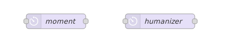
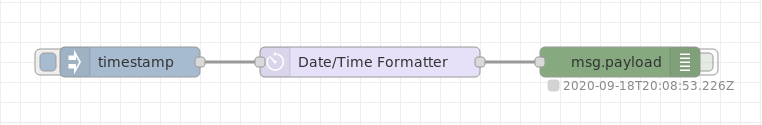
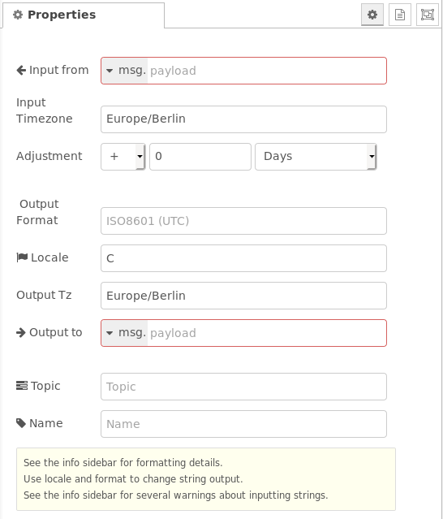
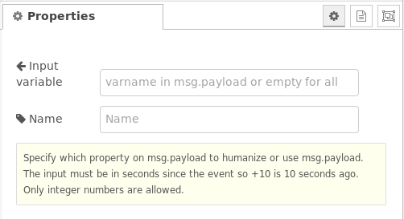

# node-red-contrib-moment

[Node-RED](http://nodered.org) node ***moment*** produces a nicely formatted Date/Time string using the Moment.JS library. The node is fully time zone/DST/locale aware.

Node ***humanizer*** converts time durations (time spans) into textual descriptions (e.g. 2 minutes).

Both nodes are locale aware regarding the language of the output strings.

  
**Fig. 1:** Node appearance


[](https://nodered.org)
[](https://www.npmjs.com/package/node-red-contrib-moment)
[](https://www.npmjs.com/package/node-red-contrib-moment)
[](https://www.npmjs.com/package/node-red-contrib-moment)
[](https://github.com/TotallyInformation/node-red-contrib-moment)
[](https://github.com/TotallyInformation/node-red-contrib-moment/watchers)
[](https://github.com/TotallyInformation/node-red-contrib-moment/stargazers)
[](https://github.com/TotallyInformation/node-red-contrib-moment/blob/master/LICENSE)
[](https://www.npmjs.com/package/node-red-contrib-moment)
[](http://packagequality.com/#?package=node-red-contrib-moment)
[](https://github.com/TotallyInformation/node-red-contrib-moment)
[](https://github.com/TotallyInformation/node-red-contrib-moment/issues)
[](https://github.com/TotallyInformation/node-red-contrib-moment/issues?q=is%3Aissue+is%3Aclosed)


Based on thoughts from a [conversation in the Node-RED Google Group](https://groups.google.com/d/msg/node-red/SXEGvfFLfQA/fhJCGBWvYEAJ). Updated with timezone/locale capabilities after Jaques44's initial work. Updated with +/- adjustments after [another conversion in the Google Group](https://groups.google.com/forum/#!topic/node-red/u3qoISFoKus).


<a name="installation"></a>
# Installation

<a name="installation_in_node-red"></a>
## In Node-RED (preferred)

* Via Manage Palette -> Search for "node-red-contrib-moment"

<a name="installation_in_a_shell"></a>
## In a shell
Basic installation:
* go to the Node-RED "userDir" folder, typically `~/.node-red`
* run `npm install node-red-contrib-moment`

To get the latest development version, install with:
* run `npm install TotallyInformation/node-red-contrib-moment`


<a name="moment_usage"></a>
# Usage of node *moment*
The easiest usage of the node is feeding it with an timestamp inject:

  

**Fig. 2:** Basic usage node *moment*


# Updates

Please see the [CHANGELOG](CHANGELOG.md) document.

# Usage

## Moment

The node generally expects an input from the incoming msg. By default, this is msg.payload. If it is a recognisable date/time, it will apply a format and output the resulting string or object accordingly.

Input and output time zones are settable as is the output locale. All of which default to the host systems tz/locale.

This allows the node to be used to translate from one time zone to another. It also will take into account daylight savings time (DST).

You can also apply an adjustment to the date/time by adding or subtracting an amount.

<a name="moment_node_configuration"></a>
## Configuration of node *moment*

  

**Fig. 3:** Properties of node *moment*


### *Input from* and *Output to*

These two configuration properties define the `msg` properties in which the input and output data are read from resp. written to. Default is `msg.payload`.

### *Input Timezone* and *Output Timezone*

#### *Input Timezone*

This property defines the timezone of the time fed via the input `msg`. Internally the input time is converted into UTC for further processing.  
The format of *Input Timezone* is in the format *region/location*, e.g. Europe/London. See also timezone lists e.g. built in to [moment-timezone](https://momentjs.com/timezone/) or given in [wikipedia](https://en.wikipedia.org/wiki/List_of_tz_database_time_zones).

**Note**: Spellings are not validated, if it doesn't seem to work, check the validity of *region/location* with these timezone lists.  

The following behaviour is valid:

- If the input data contains a Node-RED timestamp this property is ommitted
  - If the host system has a local timezone set (e.g. `dpkg-reconfigure tzdata` on Linux), the input timestamp is related to this local timezone.
  - If the host system has no local timezone set, the input timestamp is related to UTC.
- If the input data contains an interpretable string, this property is used (to convert internally to UTC).

If left blank in settings, this field may be set from the incoming `msg.inTz` property.

#### *Output Timezone*

This property defines the timezone of the time emitted via the output `msg`.
The format of *Output Timezone* is described above (see *Input Timezone*).

The following behaviour is valid:
- If *Output Format* is left blank, the output format is in 'Zulu' format, independent of the contents of the additional properties *Output Timezone* and *Locale*.

  Zulu format see: https://momentjs.com/docs/#/displaying/as-iso-string/  
  (Example: 2013-02-04T22:44:30.652Z)

If left blank in settings, this field may be set from the incoming `msg.outTz` property.

### *Adjustment*

Using this property, the time can be adjusted by a manually given value. Adjustments can be positive or negative and can be given in milliseconds, seconds, minutes, hours, days, weeks, months, quarters, years.


### *Output Format* and *Locale*

These two properties in combination define the output format emitted in the output `msg`.  

#### *Output Format*

The *Output Format* property defines the format and is described in the [moment.js displaying format section](https://momentjs.com/docs/#/displaying/format/).  

It may be any format string defined by moment.js. The formatting additions from *moment-timezone* are also allowed.  In addition, further (not case sensitive, alternatives in brackets) format strings are also allowed.  

Note that with the exception of ISO8601, other formats are in the specified timezone & DST. If not specified, the output timezone/DST is the same as the input.

Use an output timezone of UTC to force output to that.


##### Format string defined by moment.js

The format string defined by moment.js basically has two options:

- ***Manual given format string:*** This is a string where the time/date parts are represented by characters. Also text parts are allowed. Examples:
  
  - "DD.MM.YYYY HH:mm" gives *20.09.2020 08:30*
  - "dddd, MMMM Do YYYY, h:mm:ss a" gives *Sunday, February 14th 2010, 3:25:50 pm*
  - "[Today is] dddd" gives *Today is Sunday*
  - "[Date: ]YYYY-MM-DD  [Time: ]HH:mm:ss" gives *Date: 2020-09-20  Time: 08:31:45*
  - ["fromNow"](https://momentjs.com/docs/#/displaying/fromnow/) gives *in a month*	
  - ["calendar"](https://momentjs.com/docs/#/displaying/calendar-time/) gives *Last Monday*
  
- ***Predefined localized string:*** This is a string which defines a localized format. Examples:
  
  - "LLL" gives *October 20, 2020 8:33 AM*
  - "LTS" gives *8:30:25 PM*
  - "llll" gives *Thu, Sep 4, 1986 8:30 PM*

For more options see https://momentjs.com/docs/#/displaying/format/.

##### Format string is left blank resp. is "ISO8601" or "ISO"  

In this case the output is in ISO 8602 format, e.g. "2015-01-28T16:24:48.123Z".

Note that ISO8601 formatted output is ALWAYS in UTC ('Z', Zulu time) not local, no matter what output timezone you may specify.

See also [`moment().toISOString()`](https://momentjs.com/docs/#/displaying/as-iso-string/).

##### Format string is "date" resp. "jsDate"

This is a *Javascript Date object* in the form `{years:nnnn, months:n, date:n, hours:n, minutes:n, seconds:n, milliseconds:n}`. 

It may be used for manual (fixed) data/time values.

WARNING: moment.js has a bizarre object format where the month is zero-based (0-11) instead of 1-based (1-12) like all the other elements are. I don't currently know why, I've raised an upstream issue but this appears to be a deliberate decision for some strange reason. 

See also [`moment().toObject()`](https://momentjs.com/docs/#/displaying/as-object/).

##### Format string is "fromNow" resp. "timeAgo"

This is a human readable output, e.g. *30 minutes ago* or *in a month* (only rough time spans are given in this output format type, see also the *humanizer* example below). The time span is derived from the actual time and the time fed into the node.

See also [`moment().fromNow()`](https://momentjs.com/docs/#/displaying/fromnow/).

##### Format string is "calendar" resp. "aroundNow"

This is a human readable alternative, e.g. *Last Monday* or *Tomorrow 2:30pm*.
Note that dates beyond a week from now are output as yyyy-mm-dd.

See also [`moment().calendar()`](https://momentjs.com/docs/#/displaying/calendar-time/).

##### Format string is "date" resp. "jsDate"

This output format type is actually not working (see [issue #37](https://github.com/TotallyInformation/node-red-contrib-moment/issues/37)).


#### *Locale*

In case of a textual output string contents the *Locale* property defines the language of the textual parts (e.g. "October" vs. "Oktober" vs. "ottobre" vs. "lokakuuta").

If the output is shown in the wrong format, such as dates in US mm/dd/yy format, change the output locale. For example, using en_gb will force short dates to output in dd/mm/yy format. The default is en which moment assumes means the USA :-(

See also [Locale Helper](https://lh.2xlibre.net/locales/) (Note: Not every locale given there is supported).


### *Topic* (additional topic)

Using this property you can add an additional topic to the output `msg.topic`.
A resulting `msg` may be (value "myTopicString"):

```json
{"_msgid":"b16b00b5.bada55","payload":"2020-09-20T12:47:55.143Z","topic":"myTopicString"}
```


## Input of node *moment*

Input values in the object **Input from** can be of the following types:

- ***timestamp:*** The current date/time is used as input.
- ***msg***, ***global*** or ***flow*** and the given property is empty or does not exist: The current date/time is used as input.
- ***JSON date time object:*** This data time object may contain the following elements: *years*, *months*, *days*, *hours*, *minutes*, *seconds*, *milliseconds*.
  
  Example: `{"years":2020,"months":1,"date":11,"hours":5,"minutes":6}`.

  If elements are not given (e.g. *years* and *months* are missing in the object) the actual time values are used instead.

- ***a property containing a string that is a recognizable date/time:*** The value will be interpreted and processed.
  
  Example: `2020-02-11T05:06`

- ***a property containing a numeric value:*** The value will be assumed to be a [UNIX time value](https://momentjs.com/docs/#/displaying/unix-timestamp-milliseconds/) (ms since 1970-01-01). Remark: This is the format which the node *Inject* emits at option **timestamp**.
  
- ***a property containing a string that is not a recognisable date/time (including `null`):*** Then no conversion takes place, the output will be an empty string plus a debug warning.


Note that parsing date/time strings is a hard problem. moment.parseFormat helps but it isn't magic. We assume that ambiguous input dates such as 3/5/05 are in EU/UK format dd/mm/yy unless either the input timezone is in America or the locale is set to en_US.


## Outputs of node *moment*

If the **output** property is not `msg.payload` the input `msg.payload` is retained in the output.

The date/time output is a formatted string if the configuration property ***Output Format*** is anything other than *date* resp. *jsDate* or *object* in which case the output is a Javascript date object or an object as described below respectively.

Output string formatting is controlled by the ***Locale*** and the ***Output Format*** setting. Note that the output Timezone is ignored for ISO8601 output (the default), such output is always in UTC. For other formats, the output will be in the specified timezone which defaults to your host timezone.

Specifying different input and output timezones allows you to translated between them.

The output `msg` will pass through the input `msg.topic` unless it is overridden by the ***Topic*** configuration property. If the ***Output to*** field is changed from the default `msg.payload`, the input `msg.payload` will also be passed through.


# Usage of node *humanizer*

This node converts an input time span to a humanized text string to the output `msg.payload.humanized`. The language of the output string is derived from the locale of the system, i.e. it is not changeable (like the *Locale* property of the *moment* node).  

See also [moment.duration().humanize()](https://momentjs.com/docs/#/durations/humanize/).

(Contributed by [Laro88](https://github.com/Laro88))


## Configuration of node *humanizer*

  
**Fig. 4:** Properties of node *humanizer*

### 'Input variable'

This property defines the input `msg.payload` property which shall be used for the conversion. If left blank, `msg.payload` is used.

## Input of node *humanizer*

The input is a number which defines a time span in seconds.

## Outputs of node *humanizer*

The output is a string object in `msg.payload.humanized`.  
The time spans are evaluated in intervals, see *humanizer* example for details.


# Examples

***
**Remark**: Example flows are present in the examples subdirectory. In Node-RED they can be imported via the import function and then selecting *Examples* in the vertical tab menue.  
All example flows can also be found in the examples folder of this package.
***


## Usage of the *moment* node

The basic usage is shown in Fig. 2. The following examples shall give an overview how to use the rich configuration properties.

### Usage of configuration properties *Output Timezone*, *Output Format* and *Adjustment*

A sample flow is:

  
[**output-timezone-format-adjustment flow**](examples/timezones-outputformat-example-flow.json)  
**Fig. 5:** Example flow showing the usage of *Output Timezone*, *Output Format* and *Adjustment*


### Usage of configuration property *Input Timezone*

A sample flow is:

  
[**input-timezone flow**](examples/input-timezones-example-flow.json)  
**Fig. 6:** Example flow showing the usage of *Input Timezone*


### Usage of configuration properties *Output Format* and *Locale*

A sample flow is:

  
[**output-format-locale flow**](examples/locale-example-flow.json)  
**Fig. 7:** Example flow showing the usage of *Output Format* and *Locale*


## Usage of the *humanizer* node

A sample flow is:

  
[**humanizer flow**](examples/humanize-example-flow.json)  
**Fig. 8:** Example flow showing the usage of the *humanizer* node


# Depends on

- [Moment.js](http://momentjs.com/docs) - Clever date/time handler for Node.js and browsers
- [Moment-Timezone](http://momentjs.com/timezone/docs) - Adds timezone and locale awareness to Moment.js
- [Zulu](https://momentjs.com/docs/#/displaying/as-iso-string/) time format
- [Timezones](https://en.wikipedia.org/wiki/List_of_tz_database_time_zones/) (tzdata)
- [Moment-ParseFormat](https://github.com/gr2m/moment-parseformat) - Tries to interpret input strings as date/times and creates a format string that moment.js can use.
- [Locale Helper](https://lh.2xlibre.net/locales/) - lists locale options
- [Node-RED](http://nodered.org/docs/) - of course!


# To Do

Summary of things I'd like to do with the moment node (not necessarily immediately):

* [ ] Add some additional nodes for doing date/time calculations - partly complete, can do simple add/subtract from main node
* [ ] Add additional node for doing duration calculations
* [ ] Add a combo box to the Format field with common formats pre-populated
* [x] Improve the error messages when Moment.JS fails to interpret the input (say why)
* [x] Allow more input date/time formats - turns out Moment.JS doesn't really help here. At present, I see too many input failures from US/UK date formats, etc.
  It would be great if I could parse "human" inputs like "tomorrow" and "2 minutes from now". We can output them now but not input them. As of v1.0.5, a localisation parameter is supported.

  ~~Partly complete: Added the [parseFormat plugin](https://github.com/gr2m/moment.parseFormat). That failed, see code for details.~~ Now complete.

# License

This code is Open Source under an Apache 2 License. Please see the [apache2-license.txt file](https://github.com/TotallyInformation/node-red-contrib-moment/apache2-license.txt) for details.

You may not use this code except in compliance with the License. You may obtain an original copy of the License at

    http://www.apache.org/licenses/LICENSE-2.0

Unless required by applicable law or agreed to in writing, software distributed under the License is distributed on an
"AS IS" BASIS, WITHOUT WARRANTIES OR CONDITIONS OF ANY KIND, either express or implied. Please see the
License for the specific language governing permissions and limitations under the License.

# Author

[Julian Knight](https://uk.linkedin.com/in/julianknight2/) ([Totally Information](https://www.totallyinformation.com)), https://github.com/totallyinformation


# Contributors/Credits

* [Vicary Archangel](https://github.com/vicary)
* [Steve Rickus](https://github.com/shrickus)
* [Jes Ramsing](https://github.com/Laro88)
* [Jacques W](https://github.com/Jacques44)
* [StephanStS](https://github.com/StephanStS)

Many thanks for the contributions.

# Feedback and Support

Please report any issues or suggestions via the [Github Issues list for this repository](https://github.com/TotallyInformation/node-red-contrib-moment/issues).

For more information, feedback, or community support see the Node-RED Google groups forum at https://groups.google.com/forum/#!forum/node-red
