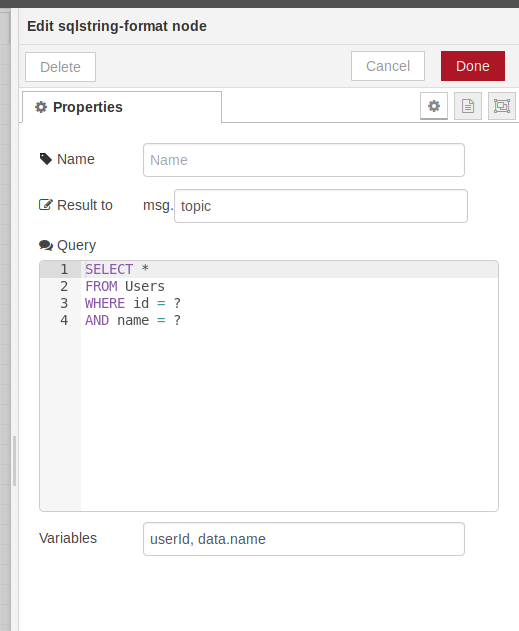
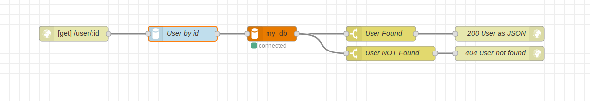
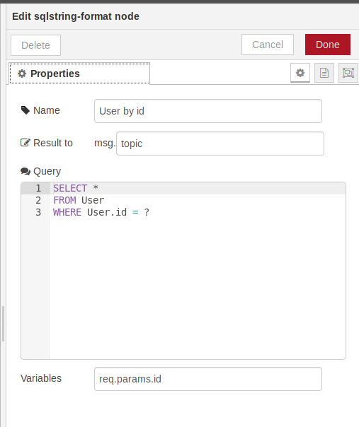

# node-red-contrib-sqlstring

A [Node-RED](http://nodered.org) node for formatting SQL-Queries to avoid SQL-Injections.

The commonly used `node-red-node-mysql` allows SQL-Injections (one of most common security risks for web applications).

SQL-Queries with user provided variables, have to be secured.

The `sqlstring-format` node creates SQL-Queries and escapes provided variables.

The escaping is performed with: [https://github.com/mysqljs/sqlstring](https://github.com/mysqljs/sqlstring) (library with 500k downloads per week)

## Example

