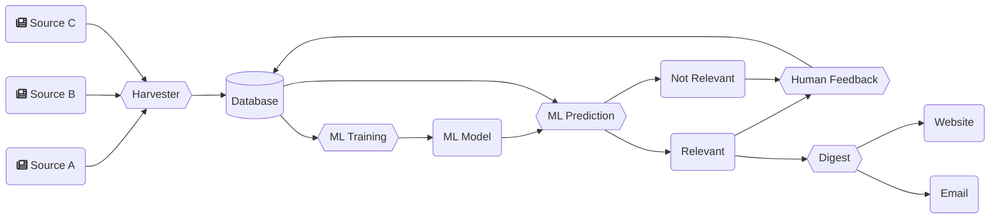
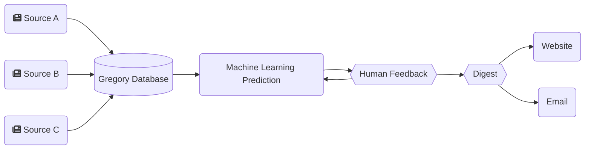

# Gregory, an AI to assist research and monitor science

When Gregory was "born" in February 2021, the goal was to aggregate searches across a number of sites like [PubMed](https://pubmed.ncbi.nlm.nih.gov/), [FASEB](https://faseb.onlinelibrary.wiley.com/), [ClinicalTrials.gov](https://clinicaltrials.gov/), and a few others. 

Today, Gregory is an Artificial Intelligence (AI) system that uses Machine Learning (ML) to index articles from any number of sources. Its focus is on scientific research, but can be used for any number of purposes where the main obstacle is to filter information. 

An example of Gregory's workflow:

A practical implementation can be found at [Gregory-MS.com](https://gregory-ms.com), where we have indexed over 13,000 articles on Multiple Sclerosis Research to assist Neurologists and Researchers.

## Use Cases

### For researchers of any field

Gregory can act as a research assistant by fetching the latest articles and organising them into categories. These categories can then be plotted in a chart to see which need further research, and which are “too crowded”.

### For healthcare professionals of any specialty

Using the right sources, it’s possible to have Gregory stay up to date with what is being published about any disease, condition, or medication. Turn it into an observatory for one or more subjects.

### For everyone filtering for important news

Using the machine learning algorithm, Gregory can help cut the noise from the river of news by learning what is important in a particular context. 

By creating an email list, teams can receive a digest of the relevant articles found, or real time notifications.

This allows you to chart the news and identify trends with greater ease.

### Build a central point of knowledge

Developers can use the Application Protocol Interface (API) to connect Gregory to any system, displaying the articles filtered by any query, or embedding the charts.

### Keep everyone in the loop

The email notifications can be sent to any email address, without the need for a registered user account.

## How it works

An example of Gregory's workflow:

## Features

- Index scientific papers, news articles, and clinical trials
- Index any content from RSS feeds and other sources
- Index content by subject
- Index content by category
- Send email to the admin team with content that needs to be flagged for relevancy
- Run a Machine Learning prediction on new content to categorise for relevancy
- Send weekly digest of relevant content to subscribers
- Send notification of new content via email
- Output RSS feeds of articles per source, category, subject, and relevancy
- Output an RSS feed of clinical trials

