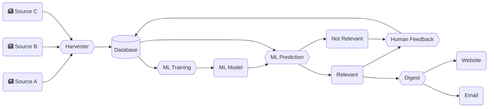

# Gregory, an AI to assist research

When Gregory was "born" in February 2021, the goal was to aggregate searches across a number of sites like [PubMed](https://pubmed.ncbi.nlm.nih.gov/), [FASEB](https://faseb.onlinelibrary.wiley.com/), [ClinicalTrials.gov](https://clinicaltrials.gov/), and a few others. 

Today, Gregory is an Artificial Intelligence (AI) system that uses Machine Learning (ML) to index articles from any number of sources. Its focus is on scientific research, but can be used for any number of purposes where the main obstacle is to filter information. 

An example of Gregory's workflow:

A practical implementation can be found at [Gregory-MS.com](https://gregory-ms.com), where we have indexed over 13,000 articles on Multiple Sclerosis Research to assist Neurologists and Researchers.

## Main Features

- Index articles from RSS feeds and other sources
- Index sources of articles by subject
- Index articles by category
- Index clinical trials 
- Send email to the admin team with content that needs to be flagged for relevancy
- Run a Machine Learning prediction on new content to categorise for relevancy
- Send weekly digest of relevant content to subscribers
- Send notification of new clinical trials via email
- Output RSS feeds of articles per source, category, subject, and relevancy
- Output an RSS feed of clinical trials 

