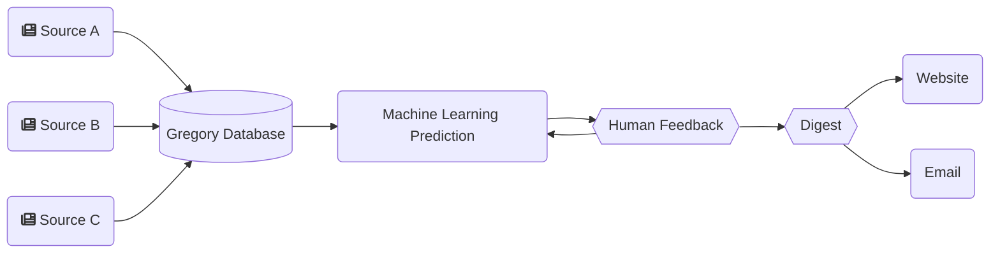

# Gregory, an AI to assist research and monitor science

Gregory is an Artificial Intelligence (AI) to index and identify relevant content from any number of sources.

It uses Machine Learning (ML) to predict relevancy. And includes a [Metabase](https://metabase.com/) instance to classify and quantify information.

A full version is available at [Gregory-MS.com](https://gregory-ms.com), where we have indexed over 13,000 articles on Multiple Sclerosis Research to assist Neurologists and Researchers.

## Use Cases

### For researchers of any field

Gregory can act as a research assistant by fetching the latest articles and organising them into categories. These categories can then be plotted in a chart to see which need further research, and which are “too crowded”.

#### Jobs to be done

- Literature review
- Map out areas of current research
- Identify Research trends

### For healthcare professionals of any specialty

Using the right sources, it’s possible to have Gregory stay up to date with what is being published about any disease, condition, or medication. Turn it into an observatory for one or more subjects.

#### Jobs to be done

- Get relevant information in real time
- Track research around specific therapeutics

### For everyone filtering for important news

With the machine learning algorithm, Gregory learns what is important to its users and cut the noise from the river of news . 
By creating an email list, teams can receive a digest of the relevant articles found, or real time notifications.

This allows you to chart the news and identify trends with greater ease.

#### Jobs to be done

- Real time notification of relevant news (no Fear Of Missing Out)
- Identify trends

### Build a central point of knowledge

Developers can use the Application Protocol Interface (API) to connect Gregory to any system, displaying the articles filtered by any query, or embedding the charts.

### Keep everyone in the loop

The email notifications can be sent to any email address, without the need for a registered user account.

#### Jobs to be done

- Send newsletters or other digests to teams
- Feed a website with curated information in real time

## How it works

Gregory's workflow:

## Features

- Index scientific papers, news articles, and clinical trials
- Index any content from RSS feeds and other sources
- Index content by subject
- Index content by category
- Send email to the admin team with content that needs to be flagged for relevancy
- Run a Machine Learning prediction on new content to categorise for relevancy
- Send weekly digest of relevant content to subscribers
- Send notification of new content via email
- Output RSS feeds of articles per source, category, subject, and relevancy
- Output an RSS feed of clinical trials

