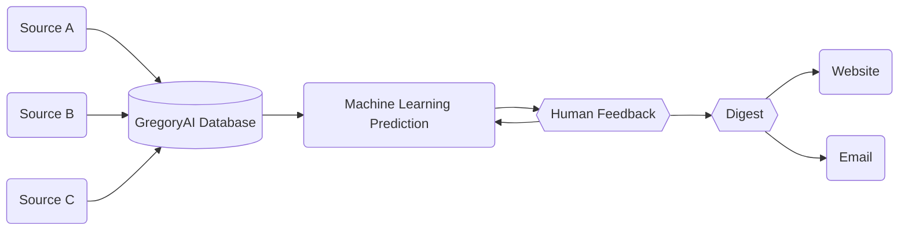

# GregoryAI — introduction

GregoryAI is an AI system that uses Machine Learning and Natural Language Processing to track research and identify papers that improve the wellbeing of patients. It ingests content from RSS feeds, API endpoints, and manual submissions, applies ML relevance predictions, and delivers curated digests via email and API.

A public instance tracking brain regeneration research is available at [brain-regeneration.com](https://brain-regeneration.com), with its API at [api.brain-regeneration.com](https://api.brain-regeneration.com).

---

## Who uses GregoryAI

| Audience | What they get from it |
|:---------|:----------------------|
| Researchers | Literature review, trend mapping across categories, identification of crowded vs. underexplored topics |
| Healthcare professionals | Real-time updates on diseases, conditions, and therapeutics they follow |
| Filtered-news readers | Daily/weekly digests with noise removed by ML and human feedback |
| Developers and integrators | API access to articles, trials, authors, and categories for embedding in other systems |

---

## Features

- Machine Learning prediction of relevant content
- Key takeaways extracted using AI
- RSS feed ingestion from PubMed and other sources
- Configurable searches on any public website
- Automatic email notifications with admin and subscriber digests
- Subscriber management with per-list consent tracking
- Public and private REST API and RSS feeds
- Configurable categories based on keyword matching
- Multiple subjects to segment research areas
- Author identification with ORCID support

---

## How it works

```mermaid
flowchart LR
  SourcesA(Source A) --> DB[("GregoryAI Database")]
  SourcesB(Source B) --> DB
  SourcesC(Source C) --> DB
  DB --> Model("Machine Learning Prediction")
  Model --> RF{{"Human Feedback"}}
  RF --> Model
  RF --> PD{{"Digest"}}
  PD --> site("Website")
  PD --> email("Email")
```

Sources feed into the database. ML models score each article for relevance. Human reviewers flag articles as relevant or not, which in turn improves the models over time. Relevant articles are published via the website and sent to email subscribers.

---

## Core concepts

**Article** — a published piece of content: a science paper, a news article, or a clinical trial summary.

**Source** — a website or feed from which GregoryAI pulls articles. Sources are configured with a method (`rss`), a subject, and a content type (`science paper`, `news`, or `trials`).

**Subject** — a named research area (e.g., "Multiple Sclerosis"). Groups sources and their articles. ML models are trained per subject.

**Category** — a keyword-based filter applied across subjects. Articles whose titles match at least one keyword in a category's term list are tagged with that category.

**Team** — a logical group that owns subjects, sources, and subscribers. Multiple teams can run on a single GregoryAI instance.

See the [glossary](glossary.md) for a full list of terms.
