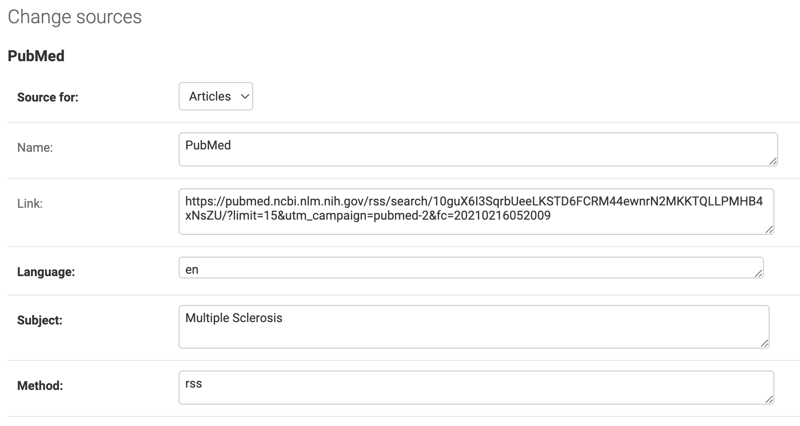

# Sources and articles

> Audience: operators and developers configuring GregoryAI sources and working with the article model.

Some core concepts before we start. GregoryAI uses the term **Article** to refer to both science papers published in journals and news articles from other sources.

A **Source** is any website from which GregoryAI can extract articles.

A **Subject** is a group of Sources and their respective articles.

A **Category** is a group of articles whose title matches at least one keyword in a term list for that category. Categories can include articles across subjects.

---

## Sources

You can add sources through the Django admin at `/admin/`. The screenshot below shows how to add PubMed as an RSS source.



| Field | Description |
|:------|:------------|
| `source_id` | Primary key |
| `name` | Human-readable source name |
| `link` | URL of the RSS feed |
| `language` | Language of the source content |
| `subject` | The subject this source belongs to |
| `method` | How content is fetched — `rss`, `scrape`, `manual`, `ctgov_api`, or `ctis_api` |
| `source_for` | Content type produced: `science paper`, `news`, or `trials` |
| `ignore_ssl` | Whether to bypass SSL certificate verification |

### CTIS public API sources (`method="ctis_api"`)

Fetches the full CTIS (EU Clinical Trials Information System) result set via the
undocumented public search API — see [docs/ctis-public-api-schema.md](ctis-public-api-schema.md)
for the full request/response contract. Unlike the CTIS RSS feed (`method="rss"`,
still active and never retired — it's the EMA-advertised channel and the fallback if
the undocumented API access is ever withdrawn), the API returns every matching trial,
not just the 15 most recently updated.

Configuration: `source_for="trials"`, `link` left empty (search criteria drive the
fetch, not a URL), and `ctis_search_criteria` set to the verbatim `searchCriteria`
dict POSTed to the API, e.g. `{"medicalCondition": "Multiple Sclerosis"}`. Supported
keys: `medicalCondition`, `sponsor`, `number`, `containAll`, `status`. Run via
`python manage.py feedreader_trials_ctis` (also wired into the `pipeline` command).

---

## Articles

| Field | Notes |
|:------|:------|
| `article_id` | Primary key |
| `title` | Article title |
| `summary` | Abstract for science papers; full body for news articles |
| `link` | Source URL |
| `published_date` | From the source feed (or CrossRef) |
| `relevant` | Manual relevance flag set in the admin |
| `ml_prediction_gnb` | Gaussian Naive Bayes prediction |
| `ml_prediction_lr` | Logistic Regression prediction |
| `ml_prediction_lsvc` | Linear SVC prediction |
| `discovery_date` | When GregoryAI first saw the article |
| `noun_phrases` | Noun chunks extracted by spaCy |
| `sent_to_admin` | Whether included in the admin digest |
| `sent_to_subscribers` | Whether included in the weekly digest |
| `source` | Foreign key → Sources |
| `doi` | Digital Object Identifier, used for de-duplication and CrossRef enrichment |
| `kind` | One of: `science paper`, `news`, `trial` |

---

## Endpoints by subject and category

Use these formats to filter the article list. The `<subject>` and `<category>` slug is the lowercase name with spaces replaced by dashes.

### RSS feeds

```text
https://example.com/feed/articles/subject/<subject>/
https://example.com/feed/articles/category/<category>/
```

### API endpoints

```text
https://example.com/articles/?subject_id=<id>
https://example.com/articles/?category_slug=<category>
```

For the full list of filtering parameters, see [03-api-and-rss-feeds.md](03-api-and-rss-feeds.md).
