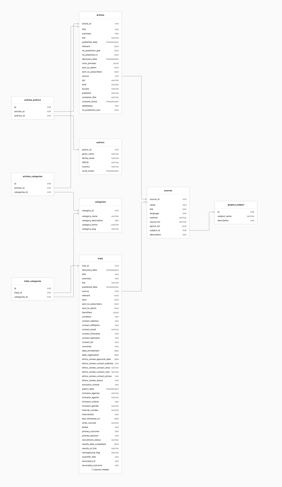

# Database tables and fields

> Audience: developers and data scientists working directly with the GregoryAI schema.

---

## Articles

An article is a published piece of knowledge, usually assigned `kind = 'science paper'`.

| Field name | Field type | Options / Comments | Description |
|:-----------|:-----------|:-------------------|:------------|
| `article_id` | AutoField | primary_key=True | |
| `title` | TextField | blank=False, null=False, unique=True | |
| `link` | URLField | max_length=2000, blank=False, null=False | |
| `doi` | CharField | max_length=280, blank=True, null=True | Digital Object Identifier, used to avoid duplicates. |
| `summary` | TextField | blank=True, null=True | Abstract for science papers; full body for news articles. |
| `sources` | ManyToManyField | Sources, blank=True | Feeds/registries the article was discovered in. |
| `published_date` | DateTimeField | blank=True, null=True | From source feed or CrossRef enrichment. |
| `discovery_date` | DateTimeField | auto_now_add=True | Date the article was added to the database. |
| `last_updated` | DateTimeField | auto_now=True, null=True | Date the row was last modified. |
| `authors` | ManyToManyField | Authors, blank=True | |
| `team_categories` | ManyToManyField | TeamCategory | Team-scoped categories (replaced the former global `categories` M2M). |
| `entities` | ManyToManyField | Entities | |
| `relevant` | BooleanField | blank=True, null=True | Manual relevance annotation. |
| `ml_predictions` | ManyToManyField | MLPredictions, blank=True | Per-(algorithm, subject) prediction rows; replaced the former `ml_prediction_gnb`/`_lr`/`_lsvc` boolean columns. See [ml-consensus.md](ml-consensus.md). |
| `noun_phrases` | JSONField | blank=True, null=True | spaCy-extracted noun chunks from the title. |
| `kind` | CharField | choices=KINDS, default='science paper' | `science paper`, `news`, or `trial`. |
| `access` | CharField | choices=ACCESS_OPTIONS, null=True | Open access or restricted. |
| `publisher` | CharField | max_length=150, null=True | Publisher of the journal. |
| `container_title` | CharField | max_length=150, null=True | Journal title. |
| `crossref_check` | DateTimeField | null=True | Last time CrossRef was queried for this article. |
| `retracted` | BooleanField | default=False | Whether the article has been retracted. |
| `ml_score` | FloatField | null=True | Cached average ML probability across the latest prediction per (algorithm, subject). |
| `subjects` | ManyToManyField | Subject, blank=True | Subjects the article is tagged with. |
| `teams` | ManyToManyField | Team, blank=True | Teams the article belongs to. |

> Housekeeping/scheduling fields are omitted for brevity: `links`, `utitle`/`usummary`
> (generated uppercase columns for search), `pdf_link`, and the retry-scheduling
> columns (`doi_lookup_next_check`, `doi_lookup_attempts`, `authors_next_check`,
> `authors_attempts`, `details_next_check`, `details_attempts`,
> `crossref_retraction_check`).

---

## Authors

| Field name | Field type | Options / Comments | Description |
|:-----------|:-----------|:-------------------|:------------|
| `author_id` | AutoField | primary_key=True | |
| `family_name` | CharField | max_length=150, blank=False | |
| `given_name` | CharField | max_length=150, blank=False | |
| `ORCID` | CharField | max_length=150, unique=True, null=True | Full ORCID URL, e.g. `https://orcid.org/0000-0003-3045-0304` |
| `country` | CharField | max_length=2, null=True | ISO 3166-1 alpha-2 country code, from ORCID profile. |
| `orcid_check` | DateTimeField | null=True | Last time ORCID was queried to avoid overloading the service. |

---

## Categories

| Field name | Field type | Options / Comments | Description |
|:-----------|:-----------|:-------------------|:------------|
| `category_id` | AutoField | primary_key=True | |
| `category_name` | CharField | max_length=200, null=True | |
| `category_description` | TextField | null=True | |
| `category_slug` | SlugField | unique=True, null=True | Used to build the API endpoint. |
| `category_terms` | ArrayField | CharField(max_length=100), default=list | Comma-separated keyword terms for this category. |

---

## Sources

A source can be an RSS feed, web scrape, manual import, or manual article addition. RSS sources are processed automatically.

| Field name | Field type | Options / Comments | Description |
|:-----------|:-----------|:-------------------|:------------|
| `source_id` | AutoField | primary_key=True | |
| `source_for` | CharField | choices=TABLES, default='science paper' | `science paper` or `trials` |
| `name` | TextField | null=True | |
| `link` | TextField | null=True | Feed URL. |
| `language` | TextField | | Usually `en`. |
| `subject` | ForeignKey | Subject, null=True | Related research subject. |
| `method` | CharField | choices=METHODS, default='rss' | `manual`, `xml import`, `scrape`, or `rss`. |
| `ignore_ssl` | BooleanField | default=False | Bypass SSL verification (used for sources with faulty certs). |
| `description` | TextField | null=True | Notes on source configuration (e.g. PubMed search URL). |

---

## Subject

| Field name | Field type | Options / Comments |
|:-----------|:-----------|:-------------------|
| `subject_name` | CharField | max_length=50, blank=False |
| `description` | TextField | null=True |
| `ml_consensus_type` | CharField | choices: `any`, `majority`, `all`; default=`any`. See [ml-consensus.md](ml-consensus.md). |

---

## Trials

Clinical trial records, sourced from WHO ICTRP, ClinicalTrials.gov (CTGov API), and
the EU CTIS / euclinicaltrials.eu register. Fields are grouped by origin below.

> **Derived fields** (marked *derived*, `editable=False`) are recomputed from their raw
> counterpart(s) on every `save()` — never set them directly. See
> [trials-field-normalization.md](trials-field-normalization.md) for the normalization
> rules and the related tables (`TrialCountry`, `TrialSite`, `Sponsor`) not listed here.

### Core

| Field name | Field type | Options / Comments | Description |
|:-----------|:-----------|:-------------------|:------------|
| `trial_id` | AutoField | primary_key=True | |
| `title` | TextField | blank=False, null=False | Uniqueness is enforced per registry key (partial constraints on `identifiers`), not on the title itself. |
| `summary` | TextField | null=True | Summary from the source. |
| `utitle` / `usummary` | GeneratedField | `Upper(title)` / `Upper(summary)`, db_persist=True | Persisted uppercase columns backing case-insensitive search (GIN trigram indexes). |
| `link` | URLField | max_length=2000, blank=False | Canonical registry URL — the first one discovered, kept for good (never overwritten). |
| `links` | JSONField | null=True | All known registry URLs keyed by registry slug, e.g. `{"ctgov": "…", "ctis": "…"}`. |
| `identifiers` | JSONField | null=True | Registry identifiers keyed by slug (`nct`, `euctr`, `eudract`, `euct`, `ctis`). |
| `discovery_date` | DateTimeField | null=True | Date the trial was added to the database. |
| `published_date` | DateTimeField | null=True, db_index | Registration date. |
| `last_updated` | DateTimeField | auto_now, null=True, db_index | When the row was last modified. |
| `sources` | ManyToManyField | → Sources, blank=True | Registries/feeds the trial was discovered in. |
| `teams` | ManyToManyField | → Team | |
| `subjects` | ManyToManyField | → Subject | |
| `team_categories` | ManyToManyField | → TeamCategory, through `TrialCategoryAssignment` | Team-scoped categories. |
| `ml_predictions` | ManyToManyField | → MLPredictions, blank=True | Relevance predictions per (algorithm, subject). |
| `history` | HistoricalRecords | m2m: sources/teams/subjects | Change history (django-simple-history). |

### Raw registry fields

Verbatim values as supplied by the source registry; the canonical/queryable
equivalents live under **Normalized fields** below.

| Field name | Field type | Options / Comments | Description |
|:-----------|:-----------|:-------------------|:------------|
| `export_date` | DateTimeField | null=True | |
| `internal_number` | CharField | max_length=100, null=True | WHO internal number. |
| `last_refreshed_on` | DateField | null=True | |
| `scientific_title` | TextField | null=True | |
| `primary_sponsor` | TextField | null=True | Raw lead-sponsor string (canonicalized into `primary_sponsor_normalized`). |
| `secondary_sponsor` | TextField | null=True | |
| `sponsor_type` | CharField | max_length=500, null=True | Sponsor classification (populated from `lead_sponsor_class`). |
| `prospective_registration` | CharField | max_length=10, null=True | |
| `date_registration` | DateField | null=True | |
| `source_register` | CharField | max_length=200, null=True | Source registry name (e.g., `ClinicalTrials.gov`). |
| `recruitment_status` | CharField | max_length=200, null=True, db_index | Raw recruitment-status string (e.g., `Recruiting`). |
| `acronym` | CharField | max_length=200, null=True | Trial acronym. |
| `other_records` | CharField | max_length=200, null=True | |
| `secondary_id` | TextField | null=True | |
| `source_support` | TextField | null=True | |
| `inclusion_agemin` | CharField | max_length=100, null=True | |
| `inclusion_agemax` | CharField | max_length=100, null=True | |
| `inclusion_gender` | CharField | max_length=500, null=True | Raw sex-eligibility string. |
| `date_enrollement` | DateField | null=True | Enrollment date (legacy spelling preserved in schema). |
| `target_size` | TextField | null=True | |
| `study_type` | TextField | null=True | Raw study type (e.g., `Interventional`). |
| `study_design` | TextField | null=True | |
| `phase` | TextField | null=True | Raw phase (e.g., `Phase III`). |
| `countries` | TextField | null=True | Raw countries text (legacy, last-writer-wins; superseded by `countries_by_source`). |
| `countries_by_source` | JSONField | null=True | Raw countries value per source registry, e.g. `{"ctgov": "France, United States", "ictrp": "France;Iran"}`. |
| `condition` | TextField | null=True | Medical condition under study. |
| `intervention` | TextField | null=True | |
| `primary_outcome` | TextField | null=True | |
| `secondary_outcome` | TextField | null=True | |
| `inclusion_criteria` | TextField | null=True | |
| `exclusion_criteria` | TextField | null=True | |
| `therapeutic_areas` | TextField | null=True | |

### Normalized fields (derived)

Recomputed on every `save()` from the raw field(s) shown — `editable=False`, never set directly.

| Field name | Field type | Options / Comments | Derived from |
|:-----------|:-----------|:-------------------|:-------------|
| `recruitment_status_normalized` | CharField | max_length=30, choices=`TrialRecruitmentStatus`, editable=False, db_index | `recruitment_status` |
| `phase_normalized` | CharField | max_length=20, choices=`TrialPhase`, editable=False, db_index | `phase` |
| `study_type_normalized` | CharField | max_length=20, choices=`TrialStudyType`, editable=False, db_index | `study_type` |
| `inclusion_gender_normalized` | CharField | max_length=10, choices=`TrialSexEligibility` (all/female/male), editable=False, db_index | `inclusion_gender` |
| `inclusion_age_min_years` | FloatField | null=True, editable=False, db_index | `inclusion_agemin` — canonical minimum eligible age in years (fractional for sub-year units, e.g. `6 Months` → `0.5`); null = no stated lower bound |
| `inclusion_age_max_years` | FloatField | null=True, editable=False, db_index | `inclusion_agemax` — canonical maximum eligible age in years; null = no stated upper bound |
| `regions_normalized` | JSONField | null=True, editable=False | derived from the trial's countries (region slugs: africa, asia, europe, north_america, south_america, oceania) |
| `primary_sponsor_normalized` | ForeignKey | → Sponsor, on_delete=PROTECT, editable=False | `primary_sponsor` (resolved via `SponsorAlias`) |

### Contact

| Field name | Field type | Options / Comments |
|:-----------|:-----------|:-------------------|
| `contact_firstname` | TextField | null=True |
| `contact_lastname` | TextField | null=True |
| `contact_address` | TextField | null=True |
| `contact_email` | EmailField | max_length=2000, null=True |
| `contact_tel` | TextField | null=True |
| `contact_affiliation` | TextField | null=True |

### Ethics review

| Field name | Field type | Options / Comments | Description |
|:-----------|:-----------|:-------------------|:------------|
| `ethics_review_status` | TextField | null=True | |
| `ethics_review_approval_date` | DateField | null=True | |
| `ethics_review_contact_name` | EmailField | max_length=1000, null=True | Loosely typed as `EmailField` to absorb malformed upstream supplier data — intentional, not a bug. |
| `ethics_review_contact_address` | TextField | null=True | |
| `ethics_review_contact_phone` | TextField | null=True | |
| `ethics_review_contact_email` | EmailField | max_length=1000, null=True | |

### Results

| Field name | Field type | Options / Comments | Description |
|:-----------|:-----------|:-------------------|:------------|
| `results_date_completed` | DateField | null=True | |
| `results_url_link` | URLField | max_length=2000, null=True | |
| `results_posted` | BooleanField | default=False | |
| `results_yes_no` | CharField | max_length=10, null=True | |
| `results_ipd_plan` | CharField | max_length=10, null=True | |
| `results_ipd_description` | TextField | null=True | |

### CTIS / euclinicaltrials.eu

| Field name | Field type | Options / Comments | Description |
|:-----------|:-----------|:-------------------|:------------|
| `country_status` | TextField | null=True | Per-country status text (EEA). |
| `trial_region` | CharField | max_length=500, null=True | |
| `overall_decision_date` | DateField | null=True | |
| `countries_decision_date` | JSONField | null=True | Per-country decision date (EEA), keyed by ISO 3166-1 alpha-2 code. |
| `countries_recruitment_date` | JSONField | null=True | Per-country recruitment start date from the CTIS retrieve endpoint, keyed by alpha-2 code, e.g. `{"IT": "2026-06-26"}`. |

### ClinicalTrials.gov API

| Field name | Field type | Options / Comments | Description |
|:-----------|:-----------|:-------------------|:------------|
| `ctg_detailed_description` | TextField | null=True | Detailed description from the ClinicalTrials.gov API. |
| `lead_sponsor_class` | CharField | max_length=20, null=True | Verbatim CTGov `leadSponsor.class` (INDUSTRY, NIH, FED, OTHER_GOV, INDIV, NETWORK, AMBIG, OTHER, UNKNOWN); feeds `sponsor_type`. |
