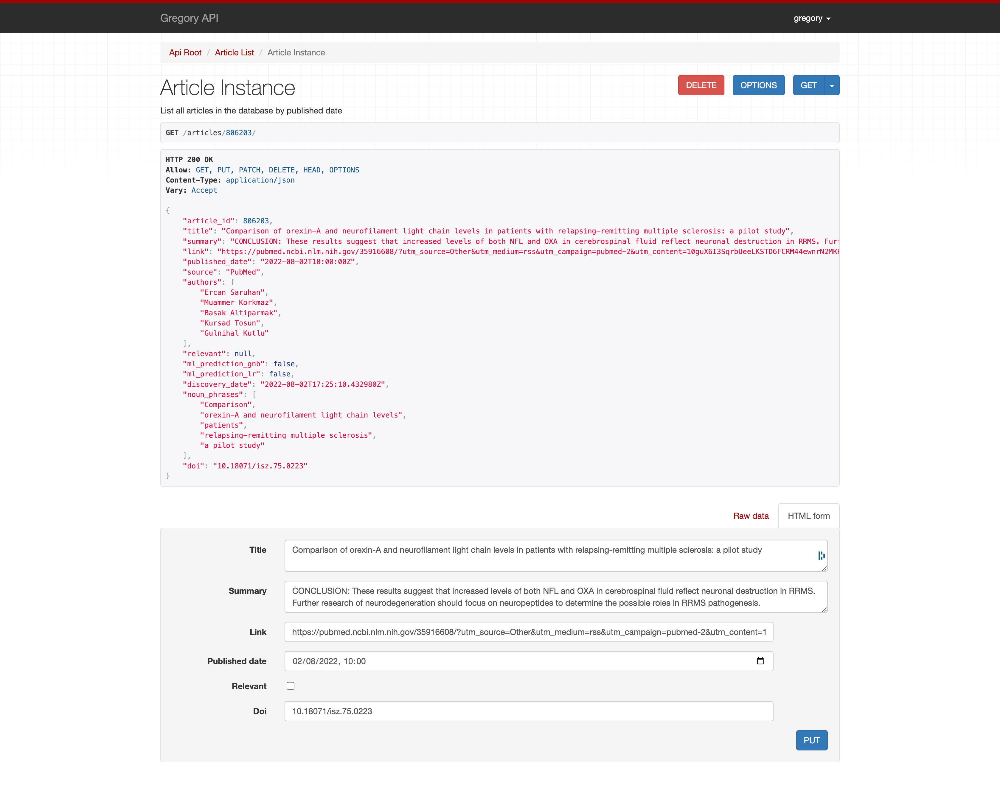

# Machine Learning 

## Flagging articles as relevant

Only administrators can flag relevant content and they need to be adde to the Subscribers list.

1. Visit https://YOUR.SITE/admin/subscriptions/subscribers/
2. Create or edit a subscriber and tick the `is admin`check box

Gregory will send an Admin Digest Email with the new content found in the last 48h. 

In the email, click the **Edit** link, and you'll be taken to the API page of that article. Make sure you're logged in on the top right corner, and edit the article to mark it as relevant using the checkbox.

## How to update the Machine Learning Algorithms

It's useful to re-train the machine learning models once you have a good number of articles flagged as relevant.

1. `cd django; source venv/bin/activate`
2. `sudo docker exec -it admin ./manage.py train_models`
