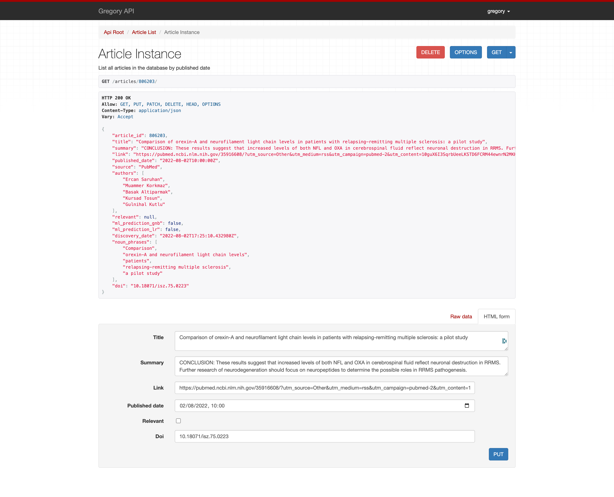

# Machine learning

> Audience: operators and data scientists using GregoryAI's ML pipeline.

---

## Flagging articles as relevant

Only administrators can flag relevant content. To become an admin reviewer:

1. Go to `https://example.com/admin/subscriptions/subscribers/`.
2. Create or edit a subscriber and tick the `is_admin` checkbox.

GregoryAI will send an admin digest email with new content found in the last 48 hours. In the email, click the **Edit** link. You will be taken to the API page of that article. Make sure you are logged in (top right corner), then edit the article to mark it as relevant using the checkbox.



---

## Training the ML models

It is useful to retrain the ML models once you have a good number of articles flagged as relevant. The full training guide is in [05-training-models.md](05-training-models.md).

Quick reference:

```bash
# Train all algorithms for a team and subject
docker exec gregory python manage.py train_models --team ms-research --subject ms

# Train a single algorithm
docker exec gregory python manage.py train_models --team ms-research --subject ms --algo pubmed_bert

# Train all teams (cron-friendly)
docker exec gregory python manage.py train_models --all-teams
```

---

## How relevance prediction works

GregoryAI trains three algorithms per subject: `pubmed_bert`, `lgbm_tfidf`, and `lstm`. Each produces a probability score between 0 and 1. A per-subject consensus rule and threshold determine whether an article is considered ML-relevant. See [ml-consensus.md](ml-consensus.md) for configuration details.

Manual relevance flags always override ML predictions.
