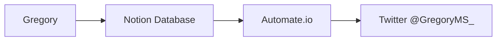

Nos últimos dias estivemos a fazer um conjunto de melhorias em dois campos: recolha de informação sobre ensaios clínicos e método de divulgação.

Os sites da CUF e Novartis agora são consultados para saber de novos estudos clínicos. Para ajudar na divulgação, o digest de email foi melhorado e integrado com uma conta de twitter. @[GregroryMS_](https://twitter.com/gregoryms_).

Além disso, foram tomadas medidas de backup para prevenir perder a informação que tem vindo a ser recolhida desde fevereiro de 2021.

Esta informação pode ser consultada e comentada no site onde gerimos toda a programação e plano de desenvolvimento: https://github.com/brunoamaral/gregory/releases/tag/v1.6

No futuro gostaríamos de acrescentar as seguintes fontes de informação para ensaios clínicos:

- RNEC
- FirstWord Pharma
- EMA
- Champalimaud Foundation
- CEIC

[Destas, a EMA tem previsto colocar online o Clinical Trial Information System em Janeiro de 2022.](https://www.ema.europa.eu/en/human-regulatory/research-development/clinical-trials/clinical-trials-information-system-training-support)

---

**O que se segue é a descrição mais completa de todas estas alterações.** 

---

## New Sources Added for Clinical Trials

- [CUF](https://www.cuf.pt/cuf-academic-center/ensaios-clinicos?combine=&unidade=&estado=All&patologia=2346&especialidade=)
- [Novartis](https://www.novartis.com/clinicaltrials/recruiting-trials?title=multiple%20sclerosis)

## New Features

1. A digest of new articles is sent to the Admin every 48h so that the most relevant findings can be flagged.
2. Weekly digest is sent to the subscribers, it lists the articles flagged by the admin.
3. The Admin now receives a notification of new clinical trials as they are posted.

## Changes

1. The file  notification flows.json replaces newsletter.json
2. The main json file with the node-red flows was cleaned up and corrected some missing links between nodes
3. The database schema was added to the repository as `gregory_schema.sql`
4. The full sqlite database was added to the repository as `gregory.sql`
5. A new flow was added that integrates with twitter using a [Notion](https://www.notion.so/) database 

## Twitter integration

Results that are flagged as relevant are posted in the account @[GregroryMS_](https://twitter.com/gregoryms_) using the service provided by [Automate.io](https://automate.io/).

# Roadmap

New sources we would like to add:
 - RNEC
 - FirstWord Pharma
 - [EMA](https://www.ema.europa.eu/en/human-regulatory/research-development/clinical-trials/clinical-trials-information-system-training-support) (CTIS system to be made available online on January 2022)
 - Champalimaud Foundation
 - CEIC (Doesn't seem to have any public database)
